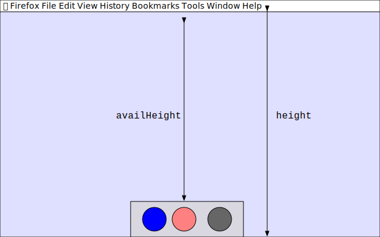

{{APIRef("CSSOM")}}

{{DOMxRef("Screen")}} インターフェイスの **`availHeight`** プロパティは読み取り専用で、画面のウェブコンテンツに利用することができる範囲の高さを、 CSS ピクセル単位で返します。 {{DOMxRef("Screen")}} は {{DOMxRef("Window")}} インターフェイスの {{DOMxRef("Window.screen", "window.screen")}} プロパティから得ることができますので、 `availHeight` は `window.screen.availHeight` を使用してアクセスすることができます。

同様に、 {{DOMxRef("Screen.availWidth")}} を使用すると、ブラウザーがウェブコンテンツに利用することができる水平方向のピクセル数を取得することができます。

## 値

画面の利用可能な空間の高さを示す CSS ピクセル数を示す数値。これは、 {{DOMxRef("Screen.height", "window.screen.height")}} の値よりも大きくすることはできず、端末やユーザーエージェントがそれ自身のために垂直方向の空間を確保している場合は、より小さくなります。

例えば、 Dock が画面の一番下（これが既定）にある Mac の場合、 `availHeight` の値は、下図のように、 `height`  (CSS ピクセル単位の画面全体の高さ) から Dock とメニューバーの高さを差し引いた値になります。

[](availheight-diagram.svg)

## 例

ウェブアプリケーションで新しいウィンドウを開く必要がある場合、例えば複数のパネルを含むことができるツールパレットのように、それが利用可能な垂直方向のスペース全体を占めるように配置したい場合、ここで見られるものと同様のコードを使用して行うことができます。

メインウィンドウでは、パネルを開くときに以下のようなコードを使用します。

```html
let paletteWindow = window.open("panels.html", "Panels", "left=0, top=0, width=200");
```

Panels ウィンドウの HTML (`panels.html`) には、独自の JavaScript コードがあり、ウィンドウが作成されるとすぐに実行されます。このコードは、特定のイベント（あらゆるイベント）を待つ必要もありません。このコードは、利用可能な空間に基づいてウィンドウの寸法の変更を処理します。

```js
window.outerHeight = window.screen.availHeight;
```

結果は以下のようになります。パネルウィンドウが画面の左にある垂直方向の空間をすべて埋めていることに注意してください。

[](screen-availheight.png)

Windows システムでは、タスクバーや空間を必要とする他のインターフェイス要素のための空間を残して、利用可能なすべての垂直方向の空間を使用するようにウィンドウを開き、垂直方向に寸法を調整することで、同様に機能します。

## 仕様書

{{Specifications}}

## ブラウザーの互換性

{{Compat}}

## 関連情報

- {{DOMxRef("Window")}}
- {{DOMxRef("Screen")}}
- {{DOMxRef("Screen.availWidth")}}
- {{DOMxRef("Window.innerHeight")}}
